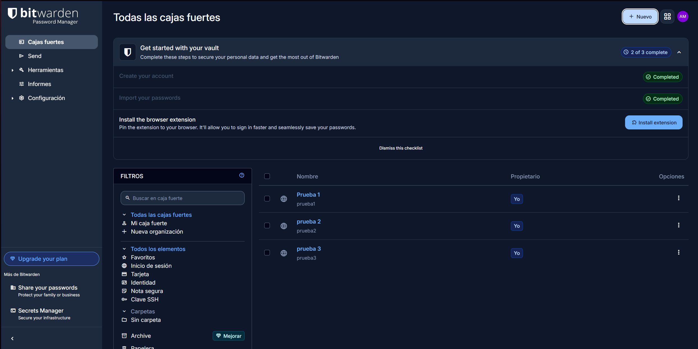

[README (1).md](https://github.com/user-attachments/files/31645993/README.1.md)
# Práctica: Mi Bóveda y Contenedor Seguro Fundamental

## 📋 Propósito

Este ejercicio integra los conceptos de **Gestión de Identidad** (gestor de contraseñas + MFA) con el **Cifrado de Datos** (VeraCrypt), construyendo un entorno donde los accesos están protegidos y los archivos sensibles permanecen inaccesibles incluso ante la pérdida de control físico del equipo.

---

## 🛠️ Herramientas Utilizadas

* **Bitwarden:** Gestor de contraseñas en la nube con cifrado de extremo a extremo.
* **VeraCrypt:** Contenedor cifrado local (AES + SHA-512).

---

## 🔐 Paso 1: Configuración de la Bóveda de Identidad

1. Se instaló y configuró **Bitwarden**, protegido con una contraseña maestra en formato *passphrase* (varias palabras aleatorias, no una palabra única).
2. Se crearon 3 registros de ejemplo en la bóveda, cada uno con una contraseña generada automáticamente ($16+$ caracteres, con símbolos y números).
3. Se activó **MFA** (inicio de sesión en dos pasos) usando una aplicación autenticadora TOTP (*Google Authenticator*), en lugar de SMS.
4. Se guardó el código de recuperación en un lugar seguro, fuera del propio gestor.

### Capturas de Pantalla

#### Captura 1: Bóveda con los nombres de las 3 cuentas de ejemplo (sin contraseñas visibles)

#### Captura 2: Panel de seguridad con el MFA activo

---

## 📦 Paso 2: Creación del Contenedor Cifrado con VeraCrypt

1. Se abrió VeraCrypt $
ightarrow$ **"Create Volume"** $
ightarrow$ **"Create an encrypted file container"**.
2. Se eligió un volumen estándar de **100 MB**.
3. Se dejaron los algoritmos por defecto: **AES** y **SHA-512**.
4. Se definió una contraseña distinta a la de la bóveda de Bitwarden.
5. Se movió el mouse aleatoriamente durante el formateo para aumentar la entropía criptográfica.

---

## 📂 Paso 3: Uso y Documentación

1. Se montó el volumen cifrado en la unidad `Z:`, ingresando la contraseña del contenedor.
2. Dentro de la unidad montada se creó el archivo `aprendizajes.txt` con tres aprendizajes clave de la unidad.
3. Se desmontó el volumen (*Unmount*), verificando que la unidad desaparece del explorador de archivos.

### Captura 3: VeraCrypt con el volumen montado y la letra de unidad asignada

---

## 💡 Aprendizajes Clave (`aprendizajes.txt`)

1. **Reutilizar la misma contraseña en varios sitios es riesgoso:** Si un sitio poco seguro es vulnerado, esa misma llave puede abrir cuentas mucho más sensibles, como el banco.
2. **No todos los métodos de MFA son igual de seguros:** SMS es el más débil (vulnerable a *SIM swapping*), mientras que una app TOTP o una llave física FIDO2 son mucho más confiables.
3. **Las Passkeys son inmunes al phishing:** Están atadas al dominio real del sitio; si el dispositivo detecta un sitio falso, se niega a usarlas.

---

## 🛡️ Notas de Seguridad

* 🔒 **Privacidad:** Las contraseñas de las cuentas de ejemplo no se muestran en ninguna captura, solo los nombres de las cuentas.
* 🔑 **Seguridad de Claves:** La contraseña maestra de Bitwarden y la contraseña del contenedor de VeraCrypt son completamente diferentes entre sí.
* 💾 **Respaldo:** Ambas contraseñas fueron guardadas de forma segura antes de cerrar el volumen.
